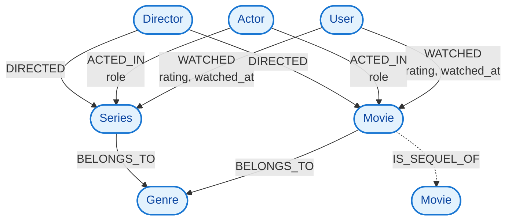

# 🎬 Modelo de Grafos para Serviço de Streaming (Neo4j)

Projeto acadêmico de modelagem de dados em grafos para um serviço de streaming similar à Netflix/Disney+, utilizando **Neo4j**.

## 📊 Diagrama Conceitual do Grafo



## 🧱 Entidades (Nós)

| Entidade   | Propriedades                          | Descrição                     |
|------------|---------------------------------------|-------------------------------|
| `User`     | `id`, `name`, `email`, `created_at`   | Assinante da plataforma       |
| `Movie`    | `id`, `title`, `year`, `duration`     | Filme individual              |
| `Series`   | `id`, `title`, `year`, `seasons`      | Série com múltiplas temporadas|
| `Genre`    | `name`                                | Categoria (Ação, Drama...)    |
| `Actor`    | `name`, `birth_year`                  | Elenco                        |
| `Director` | `name`, `nationality`                 | Diretor                       |

## 🔗 Relacionamentos

| Relacionamento | Direção                     | Propriedades               | Exemplo                          |
|----------------|-----------------------------|----------------------------|----------------------------------|
| `WATCHED`      | `User → Movie/Series`       | `rating`, `watched_at`     | Usuário avaliou filme com 9.5    |
| `BELONGS_TO`   | `Movie/Series → Genre`      | —                          | Interestelar → Ficção Científica |
| `ACTED_IN`     | `Actor → Movie/Series`      | `role`                     | Matthew McConaughey → Cooper     |
| `DIRECTED`     | `Director → Movie/Series`   | —                          | Nolan → Interestelar             |

## ⚙️ Como Executar

1. Acesse o **Neo4j Browser** ([sandbox.neo4j.com](https://sandbox.neo4j.com) ou instalação local)
2. Execute o script de modelagem:
   ```cypher
   :play https://raw.githubusercontent.com/SEU_USUARIO/streaming-graph-neo4j/main/schema.cypher
   ```
3. Teste as consultas de recomendação:
   ```cypher
   :play https://raw.githubusercontent.com/SEU_USUARIO/streaming-graph-neo4j/main/queries.cypher
   ```

> ⚠️ **Substitua `SEU_USUARIO` pelo seu username do GitHub** (ex: `https://raw.githubusercontent.com/joaosilva/streaming-graph-neo4j/main/schema.cypher`)

## ✅ Entregáveis do Projeto

- [x] Diagrama conceitual do grafo (Mermaid)
- [x] Script Cypher com constraints e dados de exemplo
- [x] Consultas de recomendação por gênero/diretor/ator
- [x] Justificativa da modelagem em grafos vs. relacional
